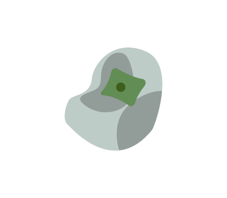

<p align="center">
  <a href="" rel="noopener">
 </a>
</p>

<h3 align="center">Bean Bag</h3>

<div align="center">

  []() 
  [](https://github.com/kylelobo/The-Documentation-Compendium/issues)
  [](https://github.com/peterforgacs/beanbag/pulls)
  [](https://opensource.org/licenses/MIT)

</div>

---

<p align="center"> Ultimate typescript serverless project development environment
    <br> 
</p>

## 📝 Table of Contents
- [About](#about)
- [Getting Started](#getting_started)
- [Deployment](#deployment)
- [Usage](#usage)
- [Built Using](#built_using)
- [TODO](../TODO.md)
- [Contributing](../CONTRIBUTING.md)
- [Authors](#authors)
- [Acknowledgments](#acknowledgement)

## 🧐 About <a name = "about"></a>
The aim of this project is to create a production ready typescript environment that supports the monorepo architecture and heavility utilises generators.

## 🏁 Getting Started <a name = "getting_started"></a>
These instructions will get you a copy of the project up and running on your local machine for development and testing purposes. See [deployment](#deployment) for notes on how to deploy the project on a live system.

```sh
npm install
```

## 🔧 Running the tests <a name = "tests"></a>

```sh
npm test
```

## 🎈 Usage <a name="usage"></a>
Clone the repository and use the NPM commands.

```sh
npm run info
```

## ⛏️ Built Using <a name = "built_using"></a>
- [NPM](https://www.npmjs.com/) - Dependency Management
- [Node.js](https://nodejs.org/en/) - Server Environment

## ✍️ Authors <a name = "authors"></a>
- [@peterforgacs](https://github.com/peterforgacs) - Idea & Initial work

See also the list of [contributors](https://github.com/peterforgacs/beanbag/contributors) who participated in this project.

## 🎉 Acknowledgements <a name = "acknowledgement"></a>
- Hat tip to anyone who is willing to contribute

